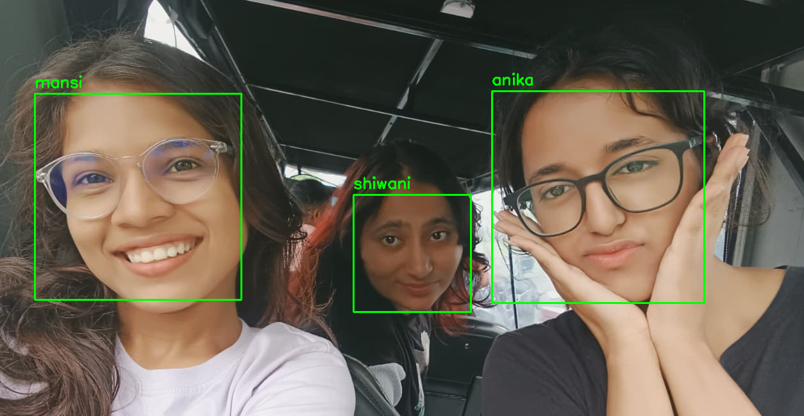
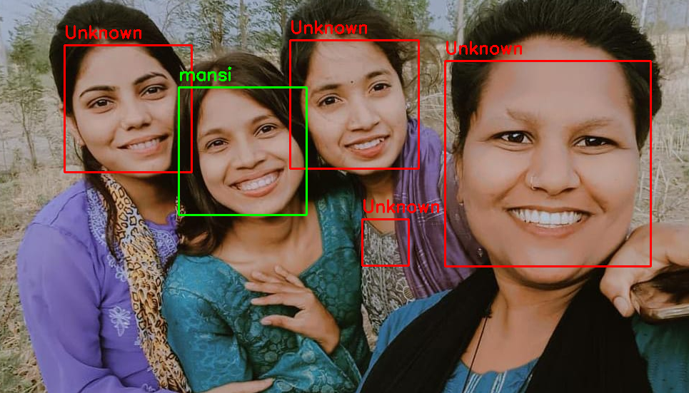

# 🎯 Face Recognition Attendance System

### 🚀 AI-Powered Attendance System using Face Recognition

## 🚀 Project Description

**Face Recognition Attendance System** is an **AI and Computer Vision based attendance management system** built using **Python, OpenCV, FaceNet, Keras-FaceNet, and NumPy**.

The system automatically detects and recognizes students from a **group image** and records their attendance without requiring manual roll calls.

It uses **OpenCV Haar Cascade** for face detection and **FaceNet** to generate facial embeddings. These embeddings are compared with registered student embeddings using **Euclidean Distance** to identify the closest matching student.

Once a student is recognized, the system automatically records their **Name, Roll Number, Date, Time, Status, Confidence, Distance, and Recognition Method** in an attendance CSV file.

The project demonstrates the practical application of **Artificial Intelligence, Machine Learning, Computer Vision, Facial Embeddings, Image Processing, and Data Management** to solve a real-world problem.

---

## 🌟 Key Highlights

- 🤖 AI-based face recognition
- 👤 Automatic face detection
- 🧠 FaceNet facial embeddings
- 📸 Group image recognition
- 👥 Multiple student recognition
- 🆔 Roll number support
- ✅ Automatic Present/Absent marking
- 📅 Automatic date and time recording
- 🎯 Face matching distance
- 📊 Recognition confidence score
- 🔄 Duplicate attendance prevention
- ❓ Unknown face detection
- 📄 Automatic CSV attendance generation
- 📂 Folder-based student dataset
- 🖥️ Visual recognition result
- ⚡ Fast automated attendance processing

---
# 🎥 Demo


## 1 Face Recognition

The system detects faces from the group image and compares them with the registered student faces.

<p align="center">

</p>

---

## 2 Unknown Face Detection

If a detected face does not match any registered student within the recognition threshold, the system identifies the person as **Unknown**.

<p align="center">

</p>

---

## 4️ Attendance CSV


```text
👥 Faces detected: 3

🔍 Minimum distance: 0.052
✅ Matched: anika
📏 Distance: 0.052
🎯 Confidence: 94.80%

🔍 Minimum distance: 0.031
✅ Matched: mansi
📏 Distance: 0.031
🎯 Confidence: 96.90%


| Date | Time | Roll Number | Name | Status | Confidence | Distance | Method |
|---|---|---|---|---|---|---|---|
| 27-08-2026 | 09:02:15 | 2303101 | Anika | Present | 94.82% | 0.052 | Face Recognition |
| 27-08-2026 | 09:02:16 | 2303121 | Mansi | Present | 97.31% | 0.031 | Face Recognition |
| 27-08-2026 | - | 2303145 | Shiwani | Absent | - | - | - |

---

# ✨ Features

- 👤 Face Detection
- 🧠 Face Recognition using FaceNet
- 📸 Group Image Processing
- 👥 Multiple Face Recognition
- 🆔 Student Roll Number Management
- 📅 Automatic Date Recording
- ⏰ Automatic Time Recording
- ✅ Present/Absent Detection
- 🎯 Face Recognition Distance
- 📊 Confidence Score
- ❓ Unknown Face Detection
- 🔄 Duplicate Attendance Prevention
- 📄 CSV Attendance Storage
- 📂 Folder-Based Dataset
- 🖥️ Recognition Result Visualization

---

# 🏗️ System Architecture

```text
                  Student Dataset
                         │
                         ▼
                 Face Detection
                         │
                         ▼
                Face Preprocessing
                         │
                         ▼
                   FaceNet Model
                         │
                         ▼
                 Face Embeddings
                         │
                         │
                         ▼
                  Group Image
                         │
                         ▼
                 Face Detection
                         │
                         ▼
                Generate Embedding
                         │
                         ▼
             Compare Face Embeddings
                         │
                         ▼
                Euclidean Distance
                         │
                         ▼
                 Recognition Check
                         │
              ┌──────────┴──────────┐
              │                     │
         Match Found            No Match
              │                     │
              ▼                     ▼
           Present               Unknown
              │
              ▼
       Attendance Processing
              │
              ▼
         Attendance CSV
